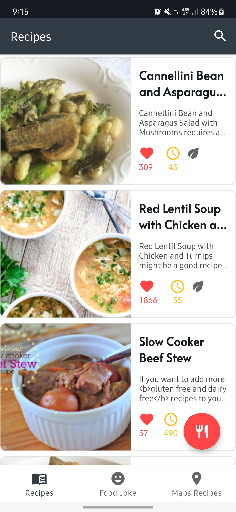
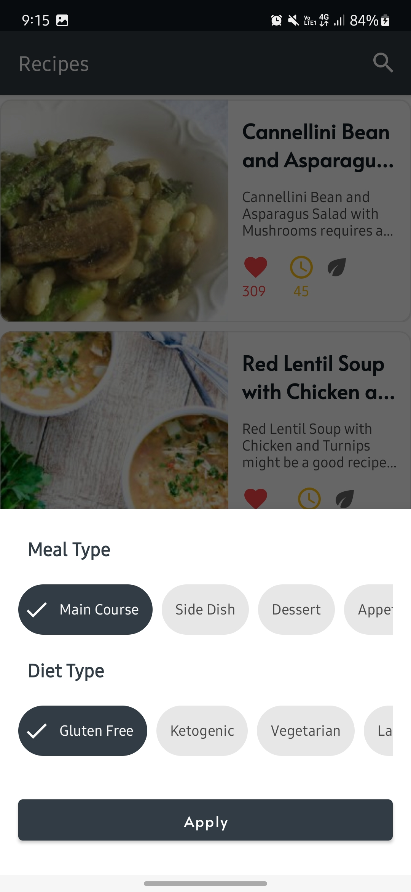
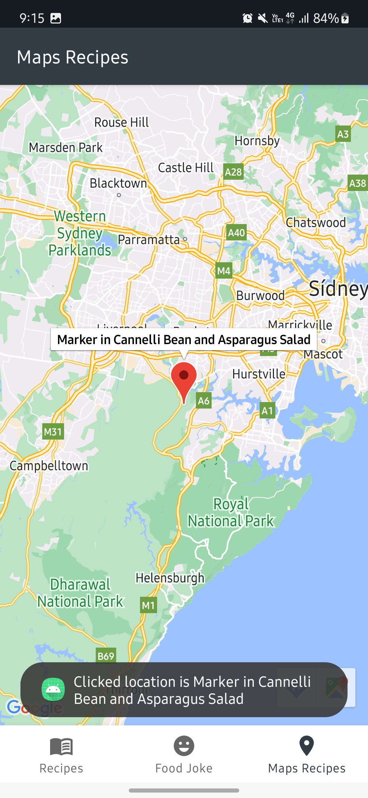
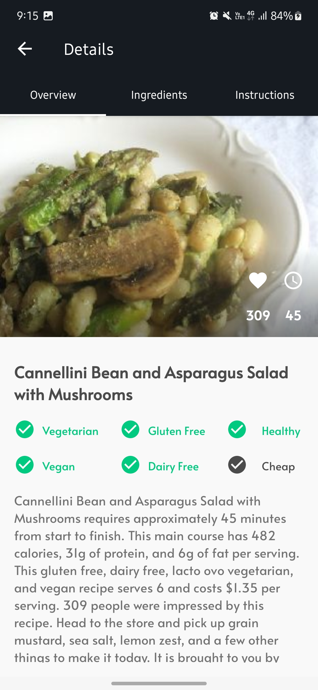
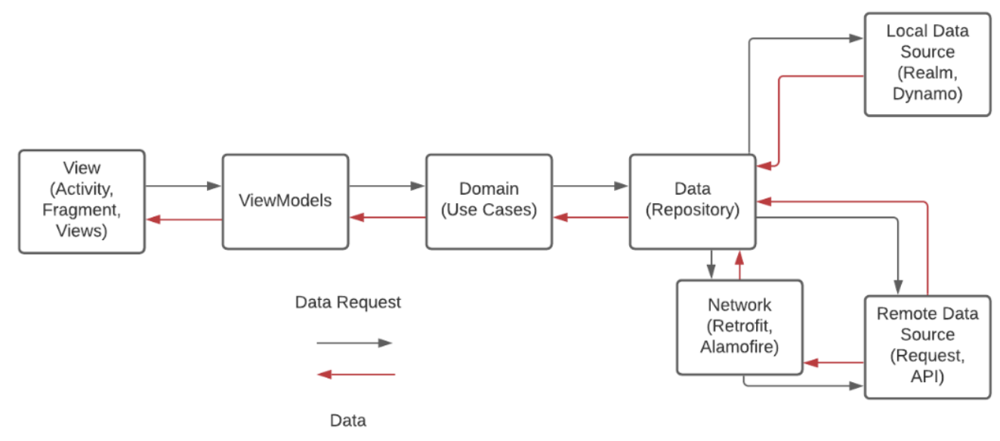
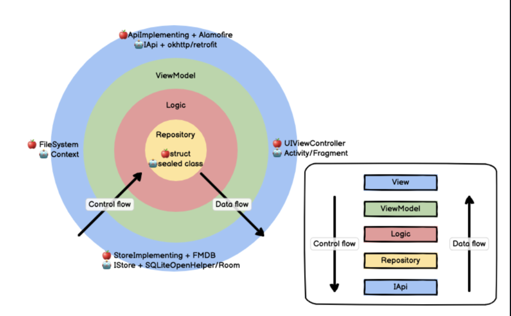
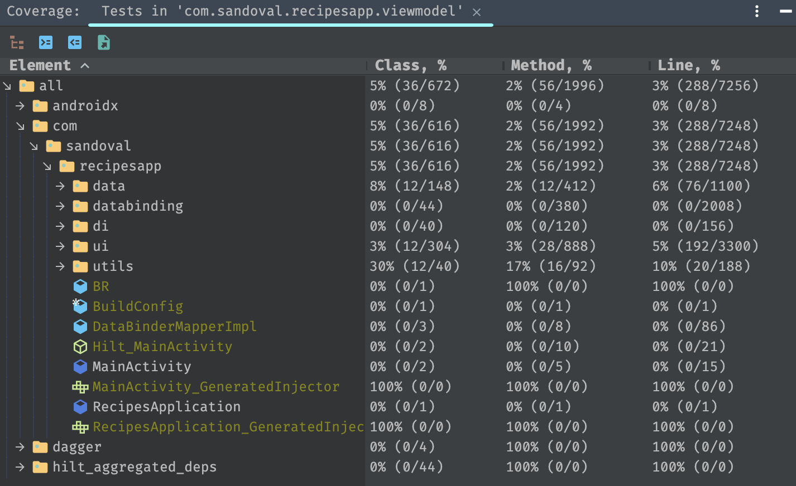

# Recipes App YAPE

[](http://kotlinlang.org/)
[](https://lv.binarybabel.org/catalog/gradle/latest)
[](http://www.apache.org/licenses/LICENSE-2.0)

This an Android App project, to show the good practices of mobile development, using S.O.L.I.D principles, MVVM pattern, Dependency Injection (DI) and Unit testing of the app.
 
## Design and View
This are the screens of My Pokedex App

| Mode  | Loading                                                       | Pokedex List Fragment                                                         | Pokedex Detail                                                          | Error                                                          |
|-------|--------------------------------------------------------------------------|------------------------------------------------------------------------------|---------------------------------------------------------------------------|---------------------------------------------------------------------------|
| Light |  |  |  |  |

## Overview
Recipes App project will be built using the principles of Clean Architecture - S.O.L.I.D as one single project (not modular) using the MVVM pattern. 
The general idea is to have the app divided like this



## Architecture and Pattern Description

The project, as is using clean architecture will be divided in:

- Data (Repository) - Remote data source (Retrofit)
- DI (Dagger hilt dependency injection)
- UI (View) - MVVM - ViewModels, States, Model Presentation, Mappers

### Advantages of Using Clean Architecture

- Our code will be even more easily testable than with plain MVVM.
- Our code will be further decoupled (the biggest advantage.)
- The package structure is even easier to navigate.
- The project is even easier to maintain.
- Our team can add new features even more quickly.



## Unit Test

Recipes App project, has unit-test that covers the complete pattern and architecture of the project
- Data (Unit tests for Repository)
- Domain (Unit tests for the Use Cases)
- UI (Unit tests for the ViewModels)


## Code Coverage

Recipes App Project is a small project but has enough coverage to be taken to 45% as the unit tests are trying to cover the complete mvvm
pattern



### Recipes App Project Packages Distribution

The architecture of the application is based, apply and strictly complies with each of the following 5 points:


-   A single-activity architecture, using the [Navigation component](https://developer.android.com/guide/navigation/navigation-getting-started) to manage fragment operations.
-   [Android architecture components](https://developer.android.com/topic/libraries/architecture/), part of Android Jetpack for give to project a robust design, testable and maintainable.
-   Pattern [Model-View-ViewModel](https://en.wikipedia.org/wiki/Model%E2%80%93view%E2%80%93viewmodel) (MVVM) facilitating a [separation](https://en.wikipedia.org/wiki/Separation_of_concerns) of development of the graphical user interface.
-   [S.O.L.I.D](https://en.wikipedia.org/wiki/SOLID) design principles intended to make software designs more understandable, flexible and maintainable.
-   [Packages architecture](https://proandroiddev.com/build-a-modular-android-app-architecture-25342d99de82) allows to be developed features in isolation, independently from other features.


### Version Control

Recipes App project, has been worked using git flow

- Every single branch represents a feature
- Nomenclature used -> [feature]/[No.Feature]_[short_description] Ex. feature/00_project_setup

### Github Action as CI

Recipes App project is using github actions, to be able to take advantages of the continous integration automation tools.

- Using ANDROID CI the repository builds the project automatically every time a new PR is created and pointed to dev branch. 
- Using ANDROID CI the repository builds the unit tests that are in the project and evaluate if a build has been succesfully created or not depending on the result of the test passed


## Contributions

All contributions are welcome!
Please feel free to post questions, recommendations, ideas, bugs by create [new issue](https://github.com/juanchosandox90/RecipesApp/issues) following the template or if you want create directly [new pull request](https://github.com/juanchosandox90/RecipesApp/pulls).

## Authors

<a href="https://www.facebook.com/costa27/" target="_blank">
  
</a>

**Juan Camilo Sandoval Devia**

[](https://www.linkedin.com/in/juan-camilo-sandoval-devia-a33955a5/)

## License

```license
Copyright 2023 Juan Camilo Sandoval

Licensed under the Apache License, Version 2.0 (the "License");
you may not use this file except in compliance with the License.
You may obtain a copy of the License at

    http://www.apache.org/licenses/LICENSE-2.0

Unless required by applicable law or agreed to in writing, software
distributed under the License is distributed on an "AS IS" BASIS,
WITHOUT WARRANTIES OR CONDITIONS OF ANY KIND, either express or implied.
See the License for the specific language governing permissions and
limitations under the License.
```


